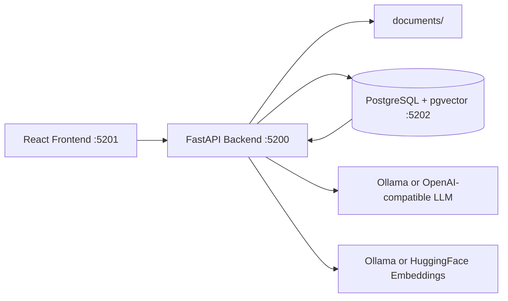

# Medical RAG Architecture and Runbook

## Overview

This project is a local medical document retrieval-augmented generation system.

It is built around four layers:

1. Document storage in `documents/`
2. Ingestion and parsing in the FastAPI backend
3. Vector storage in PostgreSQL with pgvector
4. A React frontend for upload, ingestion, clear/reset, and Q&A

The system is designed for medical PDFs, where the workflow is typically:

1. Upload PDFs
2. Parse them into documents and chunks
3. Embed and store chunks in pgvector
4. Ask questions against the indexed corpus

## System Architecture



### Components

- `frontend/`: React + Vite user interface
- `backend/`: FastAPI service with upload, ingest, clear, settings, and ask endpoints
- `documents/`: local PDF source directory
- `vectorstore/`: persisted PostgreSQL data when using the local compose stack
- `docker-compose.yml`: local pgvector + backend wiring

## Runtime Ports

- Frontend dev server: `5201`
- Backend API: `5200`
- PostgreSQL/pgvector: `5202`

## Backend Responsibilities

### `backend/app.py`

This file exposes the HTTP API and manages runtime ingestion state.

It keeps track of:

- `status`: `idle`, `running`, `completed`, or `failed`
- `job_id`: UUID per ingestion run
- `started_at` and `finished_at`
- `error`
- `result`
- `progress`

Important behavior:

- ingestion runs in a background thread
- the backend rejects `POST /data/clear` with HTTP 409 while ingestion is active
- the frontend polls `/ingest/status` to update the UI

### `backend/ingest.py`

This file implements the ingestion pipeline.

Flow:

1. Discover PDFs in `documents/`
2. Parse each PDF into LangChain `Document` objects
3. Sanitize text and metadata
4. Split documents into chunks
5. Embed and write chunks to pgvector
6. Emit progress updates to the API state

Recent operational fix:

- When the vector collection is deleted during clear/reset, re-ingest now recreates the collection before inserting chunks.
- This prevents `Collection not found` failures on subsequent runs.

### `backend/parser.py`

Parsing strategy:

1. Try Docling first
2. Fall back to PyPDF if Docling fails

This gives better coverage for structured PDFs while still supporting simpler or less compatible files.

### `backend/rag_pipeline.py`

This file wires together:

- the embedding provider
- the vector store
- the retriever
- the LLM
- the RetrievalQA chain

The prompt is constrained so the model should answer only from the retrieved context.

### `backend/config.py`

Reads configuration from `.env` and sets defaults for:

- LLM provider and model
- embedding provider and model
- pgvector connection settings
- ingestion chunk size and overlap
- retriever top-k
- timeouts

## Data Flow

### Upload

Uploaded PDFs are copied into `documents/`.

If a filename already exists, the backend appends a UTC timestamp so the file is not overwritten.

### Ingest

The ingestion process uses the PDFs in `documents/` and stores vector chunks in PostgreSQL.

The run is stateful, but it is intentionally not tied to browser login or user sessions. It is a backend job state machine.

### Ask

When you ask a question:

1. The backend builds or reuses the QA chain
2. The retriever fetches the most relevant chunks
3. The LLM answers using the retrieved context
4. Source document names and page numbers are returned to the UI

## Clear Data Behavior

The clear flow is important because it can be confused with a session problem.

`POST /data/clear` does this:

1. Optionally deletes PDFs from `documents/`
2. Optionally deletes the vector store collection
3. Resets ingestion state to `idle`

### Why 409 Happens

If ingestion is currently running, the backend returns HTTP 409 Conflict.

That is intentional. It prevents deleting the dataset while the ingestion thread is still writing chunks.

### What to Do

- Wait for ingestion to finish, then clear data
- Or add a cancel/stop endpoint if you want to interrupt ingestion first

## Current UI Behavior

The frontend exposes:

- upload controls
- ingest controls
- clear-data control
- settings editor
- question input and answer display

The UI now disables Clear data while ingestion is active and shows a direct explanation instead of a generic failure.

## API Reference

### `GET /health`

Returns backend health.

Response:

```json
{"status":"ok"}
```

### `GET /settings`

Returns active model, retrieval, and ingestion settings.

### `PUT /settings`

Updates:

- `llm_model`
- `llm_temperature`
- `ollama_num_ctx`
- `ollama_num_predict`
- `retriever_top_k`
- `ingest_chunk_size`
- `ingest_chunk_overlap`

### `GET /documents`

Lists PDFs currently available in `documents/`.

### `POST /upload`

Uploads one or more PDFs.

### `POST /ingest/start`

Starts background ingestion.

Body fields:

- `chunk_size`
- `chunk_overlap`
- `replace_collection`

Constraints:

- `chunk_size` must be greater than 0
- `chunk_overlap` must be at least 0
- `chunk_overlap` must be less than `chunk_size`

### `GET /ingest/status`

Returns live ingestion status, progress, result, and error details.

### `POST /data/clear`

Clears uploaded files and/or the vector collection.

Returns HTTP 409 if ingestion is currently running.

### `POST /ask`

Asks a question over the indexed document set.

Body:

```json
{"question":"What medications were prescribed after discharge?"}
```

## Environment Variables

The canonical runtime config lives in `.env`.

Key values:

- `LLM_PROVIDER`
- `LLM_MODEL`
- `OLLAMA_BASE_URL`
- `EMBEDDING_PROVIDER`
- `EMBEDDING_MODEL`
- `DATABASE_URL`
- `COLLECTION_NAME`
- `DOCUMENTS_DIR`
- `INGEST_CHUNK_SIZE`
- `INGEST_CHUNK_OVERLAP`
- `RETRIEVER_TOP_K`
- `OLLAMA_NUM_CTX`
- `OLLAMA_NUM_PREDICT`
- `OLLAMA_REQUEST_TIMEOUT_SECONDS`
- `ASK_TIMEOUT_SECONDS`

## Local Setup

### Prerequisites

- Python environment with the backend dependencies installed
- Node.js and npm for the frontend
- Docker and Docker Compose for PostgreSQL + pgvector
- Ollama if using local LLM or embeddings

### Install

1. Copy `.env.example` to `.env` if needed.
2. Install backend dependencies from `backend/requirements.txt`.
3. Install frontend dependencies in `frontend/`.

### Start the Stack

From the repository root:

```bash
bash script.sh
```

This starts:

- PostgreSQL + pgvector
- FastAPI backend
- React frontend

### Stop the Stack

From the repository root:

```bash
bash stop.sh
```

## Docker Compose Mode

`docker-compose.yml` starts:

- `postgres` on host port `5202`
- `backend` on host port `5200`

The backend container points `DATABASE_URL` to the compose service name `postgres`.

## Troubleshooting

### Clear returns 409

Cause: ingestion is still running.

Fix: wait for the job to finish or add a stop/cancel endpoint.

### Re-ingest fails after clear

Cause: the vector collection was deleted and not recreated.

Fix: already handled in `backend/ingest.py` by calling `vectorstore.create_collection()` before indexing.

### Ask times out

Possible causes:

- LLM is slow or unavailable
- Embedding/retrieval stack is under load
- timeouts are too low in `.env`

### No documents appear

Check:

- PDFs are in `documents/`
- upload succeeded
- ingest finished with `completed`

### Port conflicts

If another process already uses `5200`, `5201`, or `5202`, stop it before running the stack.

## Recommended Operational Flow

1. Start the stack with `bash script.sh`
2. Upload PDFs
3. Start ingestion
4. Wait for `completed`
5. Ask questions
6. If you need a fresh run, wait for ingest to stop or finish, then clear data

## Notes on the Recent Fix

The issue you hit was not a logout/session bug.

It was a backend state problem:

- the vector collection had been removed
- ingestion then tried to write into a missing collection
- that produced `Collection not found`

The current implementation recreates the collection before indexing so repeated clear/re-ingest cycles work correctly.